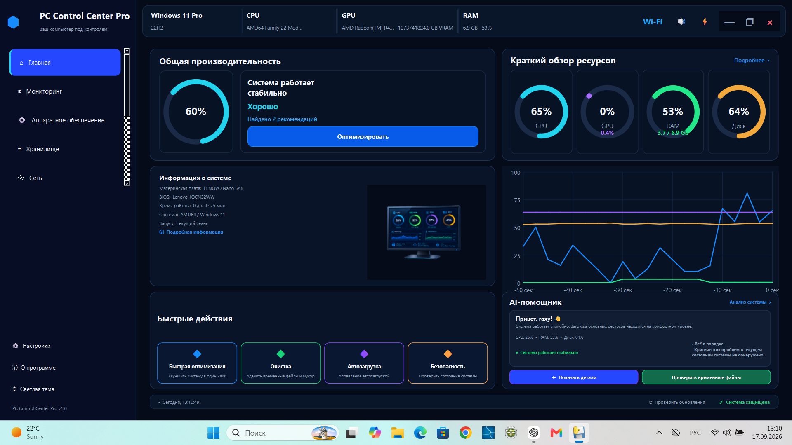
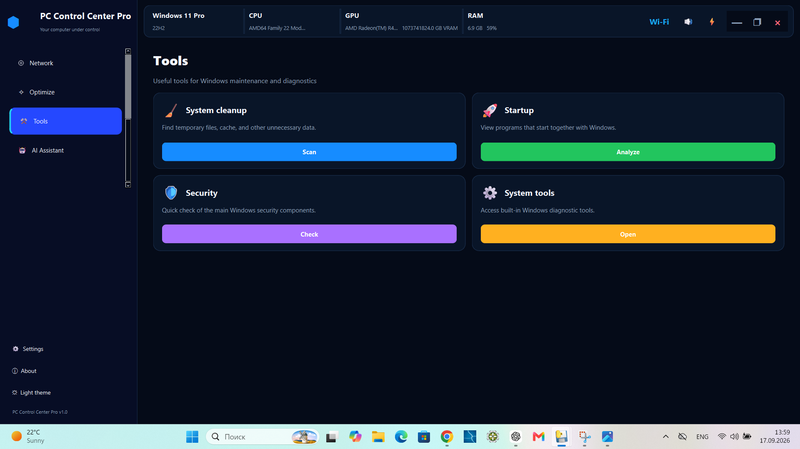

# 🖥️ PC Control Center Pro

### Modern Windows PC Monitoring, Diagnostics & System Tools

**PC Control Center Pro** is a modern Windows desktop utility that brings PC monitoring, hardware information, diagnostics, maintenance tools, startup management, and essential system utilities together in one convenient interface.

> **Monitor. Diagnose. Maintain.**
>
> **One control center for your Windows PC.**

[](#)
[](#)
[](#)
[](https://github.com/viktorasdf/PC_Control_Center_Pro/releases/latest)
[](https://github.com/viktorasdf/PC_Control_Center_Pro/releases)

---


## ✨ Features

### 📊 Monitoring Dashboard

Get a quick overview of your PC's current performance.

* Real-time CPU monitoring
* Real-time GPU monitoring
* RAM usage monitoring
* Disk usage monitoring
* Circular performance gauges
* Real-time performance graph
* System information overview
* Visual system status indicators

---

### 🛠️ System Tools

Access commonly used Windows utilities from one convenient interface.

* Windows system tools
* Maintenance utilities
* Security-related tools
* System management shortcuts

---

### ⚡ Startup Manager

Manage applications that start automatically with Windows.

* View startup applications
* Inspect startup entries
* Enable or disable startup items
* Startup analysis

---

### 🧹 PC Maintenance

Tools designed to help keep Windows clean and responsive.

* System cleanup
* Temporary file cleanup
* Maintenance operations
* Quick optimization

> Some maintenance operations may require administrator privileges.

---

### 🤖 AI Assistant & Diagnostics

Analyze system conditions and identify potential performance problems.

The diagnostic system can evaluate:

* CPU load
* RAM usage
* Disk activity
* GPU activity
* System stability
* Detected performance problems

AI-related functionality may require an Internet connection.

---

### 🖥️ Hardware Information

View important information about your computer and installed hardware.

* Processor information
* CPU cores
* Memory information
* Graphics hardware
* Storage information
* Windows information
* System model

---

### 🌍 Multilingual Interface

The application currently supports:

* 🇷🇺 Russian
* 🇺🇦 Ukrainian
* 🇬🇧 English
* 🇩🇪 German
* 🇮🇹 Italian
* 🇪🇸 Spanish
* 🇫🇷 French

---

### 🎨 Themes

Choose the interface style that works best for you.

* 🌙 Dark theme
* ☀️ Light theme

The interface is designed for a modern Windows desktop experience.

---

### 🔒 Local PC Utility

PC Control Center Pro is designed primarily as a local Windows desktop application.

The application can interact directly with Windows system components when required for monitoring, diagnostics, or maintenance operations.

---


## 🖥️ System Requirements

### Supported Platform

* **Windows 11**
* **64-bit system**
* Python is **not required** for the packaged Windows release

### Recommended

* Windows 11 64-bit
* Modern multi-core CPU
* At least 4 GB RAM
* Administrator privileges for some system maintenance operations

### AI Features

An Internet connection may be required for AI-related functionality.

### Distribution

The Windows release is available in two formats:

* **Installer** — recommended for most users
* **Portable ZIP** — extract and run without a traditional installation


## 📦 Download

### 🪟 Windows 11 — 64-bit

The easiest way to get started is to download the latest Windows release.

### 👉 [⬇️ Download PC Control Center Pro 2.0.0](https://github.com/viktorasdf/PC_Control_Center_Pro/releases/latest)

**No Python installation is required.**

#### Available packages

**Installer — recommended**

`PC_Control_Center_Pro_2.0_Setup.exe`

Use the installer for the easiest installation experience.

**Portable ZIP**

`PC_Control_Center_Pro_2.0.zip`

Download and extract the ZIP package if you prefer to run the application without using the installer.

> ⚠️ Some system maintenance and management operations may require administrator privileges.

### 📌 Important

Download PC Control Center Pro only from the official GitHub Releases page.

[Download the latest release](https://github.com/viktorasdf/PC_Control_Center_Pro/releases/latest?utm_source=chatgpt.com)

---


## ▶️ Running from Source

Developers can run **PC Control Center Pro** directly from the Python source code.

### Requirements

* Windows 11 64-bit
* Python 3.13 or compatible version
* Git
* Internet connection for installing dependencies and AI-related functionality

### Installation

Clone the repository:

```bash
git clone https://github.com/viktorasdf/PC_Control_Center_Pro.git
cd PC_Control_Center_Pro
```

Install the required dependencies:

```bash
pip install -r requirements.txt
```

### Run the application

```bash
python main.py
```

The project uses **Python** and **PySide6** for the Windows desktop interface.

> Some application features may require administrator privileges.


## 🔧 Project Structure

The project is organized into separate modules for the user interface, system monitoring, diagnostics, and supporting services.

```text
PC_Control_Center_Pro/
│
├── app/
│   ├── core/          # Application core and main window
│   ├── pages/         # Dashboard and application pages
│   ├── services/      # Monitoring, diagnostics and system services
│   └── ...
│
├── docs/              # Project documentation
│
├── main.py            # Application entry point
├── requirements.txt   # Python dependencies
├── run.bat            # Windows launcher
├── PC_Control_Center_Pro_2.0.spec
└── README.md
```

The Windows release also includes packaged versions of the application, so end users do not need to install Python.


## 🔐 Security & Privacy

PC Control Center Pro is designed as a local Windows desktop utility.

The application may interact directly with Windows system components for monitoring, diagnostics, maintenance, and system management.

### Administrator Privileges

Some features may require administrator privileges to perform system-level operations.

Windows may display a User Account Control (UAC) prompt when elevated permissions are required.

### User Responsibility

Before performing maintenance or system-management operations:

* Review the selected operation
* Keep important files backed up
* Use administrator privileges only when required
* Download the application from the official GitHub Releases page

PC Control Center Pro does not replace Windows security software or system backup solutions.


## 🚧 Development Status

**Current version: 2.0.0**

PC Control Center Pro is actively evolving.

The current public release provides:

* PC performance monitoring
* Hardware information
* System diagnostics
* Windows system tools
* Startup management
* PC maintenance utilities
* AI-assisted analysis
* Multilingual interface
* Light and Dark themes

### Future Development

Planned improvements may include:

* Additional monitoring capabilities
* More diagnostic features
* Additional Windows utilities
* Further interface improvements
* Additional language support
* Performance and stability improvements


## 🐛 Bug Reports & Suggestions

Found a bug or have an idea for improving PC Control Center Pro?

Please open an **Issue** in the GitHub repository.

When reporting a problem, include as much of the following information as possible:

* Windows version
* Application version
* Description of the problem
* Steps to reproduce the issue
* Relevant error messages
* Screenshots, if available

Clear reports help make it easier to investigate and improve the application.

## 🤝 Contributing

Contributions and feedback are welcome.

You can help improve PC Control Center Pro by:

* Reporting bugs
* Suggesting new features
* Testing new releases
* Improving documentation
* Submitting Pull Requests

### Getting Started

1. Fork the repository
2. Create a feature branch
3. Make your changes
4. Test the application
5. Submit a Pull Request

For larger changes, opening an Issue first is recommended so the proposed improvement can be discussed.


## ⭐ Support the Project

If you find **PC Control Center Pro** useful, you can support the project by:

* ⭐ Starring the repository
* 🐛 Reporting bugs
* 💡 Suggesting improvements
* 🧪 Testing new releases
* 📢 Sharing the project with other Windows users

Every star, report, and piece of feedback helps the project grow.

### 🔗 Project

**PC Control Center Pro**

https://github.com/viktorasdf/PC_Control_Center_Pro


## 📌 Release

### PC Control Center Pro 2.0.0

**First public release — September 2026**

The current release is available for **Windows 11 64-bit** as:

* 🧩 Windows Installer
* 📦 Portable ZIP package

👉 **[Download PC Control Center Pro 2.0.0](https://github.com/viktorasdf/PC_Control_Center_Pro/releases/latest)**

---

### 🖥️ PC Control Center Pro

> **Monitor. Diagnose. Maintain.**
>
> **One control center for your Windows PC.**



---

[![Windows 11](...


